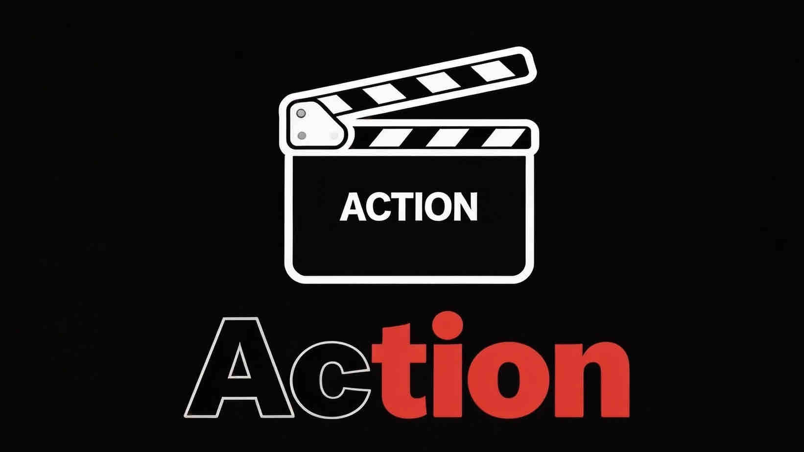

<div align="center">

 

# Action! 🎬 🎮

### An AI-Native Interactive Video Agent. 
### From Ideas to Interactive Stories. 

<p align="center">
  <a href="https://opensource.org/licenses/MIT">
    
  </a>
  <a href="https://www.python.org/">
    
  </a>
  <a href="https://github.com/Yuan-ManX/Action">
    
  </a>
</p>

#### [English](./README.md) | [中文文档](./README_CN.md)

</div>

## 🌟 What is Action?

Action! is an AI-native interactive video agent platform that transforms ideas into compelling video stories through natural language conversations. By combining a powerful AI agent infrastructure with advanced video creation capabilities, Action democratizes high-quality video production, making it accessible to everyone from beginners to professionals.

Action features an intelligent generalist AI worker that handles research, data analysis, media processing, file management, and complex workflows – showcasing what's possible when building with Action's advanced capabilities.

Whether you're a content creator, marketer, educator, or storyteller, Action empowers you to bring your vision to life with unprecedented ease and creativity.

## ✨ Key Features

### 🎬 Professional Timeline Editor
- **Multi-Track Editing**: Full support for video, audio, text, and effect tracks with independent controls
- **Drag & Drop Interface**: Intuitive clip management with drag, drop, and reordering between tracks
- **Precision Timeline**: Frame-accurate editing with zoom controls and time markers
- **Track Management**: Lock, mute, and adjust volume for individual tracks
- **Clip Operations**: Cut, trim, split, and merge clips with professional precision
- **Transition Library**: 10+ built-in transition effects including fade, dissolve, slide, wipe, and zoom
- **Clip Selection**: Visual selection and property editing for individual clips
- **Track Operations**: Add, remove, and manage multiple video, audio, and text tracks
- **History System**: Comprehensive undo/redo functionality for all editing operations
- **Real-time Hover Preview**: Preview time indicator when hovering over timeline
- **Advanced Clip Resizing**: Resize clips from both start and end points with visual feedback
- **Smooth Zoom Controls**: Intuitive zoom controls with slider and button inputs
- **Track Icons**: Visual icons for each track type for easy identification
- **Clip Gradient Colors**: Beautiful gradient colors for different clip types

### 🎨 Video Preview
- **Real-Time Preview**: Instant visual feedback of your edits
- **Frame Navigation**: Step through video frame by frame for precise editing
- **Waveform Visualization**: Beautiful audio waveform display with gradient colors for perfect timing alignment
- **Aspect Ratio Support**: Multiple aspect ratios (16:9, 9:16, 1:1, 4:3) for different platforms
- **Playback Controls**: Variable speed playback (0.25x - 2x), frame stepping, and loop modes
- **Hover Preview**: Quick frame preview when hovering over timeline
- **Enhanced Playback UI**: Beautiful gradient buttons with hover effects and smooth animations
- **Volume Controls**: Integrated volume slider and mute toggle with visual feedback
- **Clip Timeline List**: Visual clip list with active clip highlighting and click-to-seek
- **Backdrop Blur Effects**: Modern UI with backdrop blur and depth effects
- **Fullscreen Support**: Enter fullscreen mode for immersive preview experience
- **Loop Functionality**: One-click loop playback for continuous preview

### 🤖 Intelligent Agent Platform
- **Multi-LLM Support**: Works seamlessly with major LLM providers (Anthropic, OpenAI, and more) via LiteLLM
- **Extensive Tool System**: Comprehensive toolkit including web search, web scraping, file management, command execution, data analysis, and media search
- **Enhanced Conversation Memory**: Advanced context management with entity tracking, topic recognition, and preference learning
- **Security & Isolation**: Built-in security context with tool usage limits, sensitive operation tracking, and safe execution environments
- **Specialized Agents**: Create specialized agents for different roles (video creation, research, analysis)
- **Multi-Tool Execution**: Support for sequential tool calls in a single interaction

### 🌐 Web Intelligence & Research
- **Smart Web Search**: Built-in DuckDuckGo integration for comprehensive web research
- **Web Scraping**: Extract and analyze content from any web page with CSS selector support
- **Research Synthesis**: Combine multiple sources for comprehensive analysis and reporting
- **Competitive Intelligence**: Market research and trend analysis capabilities

### 📁 File & System Operations
- **File Management**: Create, read, write, delete, and organize files and directories
- **Document Processing**: Support for various document formats and file operations
- **Command Execution**: Safe command-line execution for system operations
- **Data Analysis**: Built-in statistical analysis tools for data processing

### 🎬 Smart Video Creation
- **Intelligent Script Generation**: Auto-generates storylines, narration, and visual suggestions based on your themes
- **Enhanced Media Search & Organization**: Finds, downloads, and organizes relevant images and video clips automatically with smart tagging
- **Advanced Style Transfer**: Define your preferred tone (casual, professional, humorous, etc.) via reference examples
- **Smart Recommendations**: Suggests music, voiceovers, and fonts that match your content's mood and style
- **ASR Speech Processing**: Automatic speech recognition with Whisper for transcript generation and analysis
- **Speech Rough Cut**: Auto-remove filler words, disfluencies, and repeated sentences with timestamp-aligned segmentation

### 💬 Conversational Editing
- **Natural Language Control**: Edit your video entirely through conversation - no complex timelines to master
- **Expanded Edit Commands**: Support for trimming, splitting, speed changes, captions, effects, aspect ratio changes, and more
- **Real-Time Preview**: See changes instantly as you refine your creation
- **Precision Refinement**: Adjust colors, fonts, timing, and more with simple prompts
- **Iterative Improvement**: Refine and polish your video through multiple conversation rounds
- **Skill Application**: Apply predefined workflow skills directly through conversation

### 🛠️ Enhanced Skill-Based Workflows
- **Expanded Built-in Skills**: 7+ pre-built skills including Quick Intro, Cinematic Style, Vlog Style, Speech Rough Cut, Product Review, Educational Content, Social Media Optimized, and Documentary Style
- **Custom Skill Creation**: Save your complete editing workflow as reusable skills
- **Batch Processing**: Apply the same style and workflow to multiple media assets instantly
- **Comprehensive Skill Library**: Access pre-built skills for common video creation patterns with difficulty levels (Beginner, Intermediate, Advanced)
- **Share & Collaborate**: Export and share your skills with the community

### 🎵 Advanced Audio Processing
- **Intelligent Music Recommendations**: Based on mood, genre, and content analysis
- **Voice Profile System**: Multiple voice options with tone and gender selection
- **Font Recommendations**: Smart font suggestions based on content style and mood
- **Beat Syncing**: Automatic music beat synchronization with video content
- **Audio Timing**: Precision audio timing and synchronization tools

### 💾 Advanced Project Management
- **Project Persistence**: Save and load complete video projects with full timeline state
- **Undo/Redo History**: Full edit history with unlimited undo/redo capabilities
- **Version Control**: Track changes and revert to previous versions
- **Project Metadata**: Customizable project settings including resolution, frame rate, and aspect ratio
- **Clip Properties**: Detailed clip metadata and property editing panel

## 🏗️ Architecture

Action is built on a cohesive, modular architecture designed for scalability and extensibility:

### Core Components
- **Backend API**: Python/FastAPI service powering agent orchestration, video processing, and enhanced media capabilities
- **Frontend Dashboard**: Next.js/React application providing intuitive user interface
- **Agent Runtime**: Enhanced isolated execution environments for secure agent operations with security context
- **Data Layer**: PostgreSQL + Supabase ready for persistent storage and real-time updates
- **Speech Processing System**: Whisper-based ASR with speech cleaning and rough cut generation
- **Enhanced Media Library**: Advanced media asset management with intelligent indexing

### Technology Stack
- **Backend**: Python 3.8+, FastAPI, LiteLLM
- **Frontend**: Next.js 14, React, TypeScript, Tailwind CSS
- **Video Processing**: FFmpeg, MoviePy
- **Speech Recognition**: OpenAI Whisper
- **Web Tools**: Playwright, BeautifulSoup4, DuckDuckGo Search
- **Containerization**: Docker, Docker Compose
- **Database**: PostgreSQL, Supabase (ready)

## 🚀 Quick Start

### Prerequisites
- Python 3.8 or higher
- Node.js 18 or higher
- FFmpeg (for video processing)
- API keys for your preferred LLM provider(s) (OpenAI, Anthropic, etc.)

### Installation

1. **Clone or Download the Repository**
```bash
git clone https://github.com/Yuan-ManX/Action.git
cd Action
```

2. **Set up Backend**
```bash
cd backend
python -m venv venv
source venv/bin/activate  # On Windows: venv\Scripts\activate
pip install -r requirements.txt
```

3. **Configure Environment**
```bash
cp .env.example .env
# Edit .env with your API keys and configuration
```

4. **Set up Frontend**
```bash
cd ../frontend
npm install
```

5. **Install Playwright (for browser automation)**
```bash
playwright install
```

6. **Start Action**
```bash
cd ..
python start.py
```

This will automatically start:
- Backend API on http://localhost:8000
- API Documentation on http://localhost:8000/docs
- Frontend Dashboard on http://localhost:3000

7. **Access the Dashboard**
Open your browser and navigate to `http://localhost:3000`

## 📖 Usage Guide

### Creating Your First Video

1. **Start a Conversation**: Tell Action what kind of video you want to create
2. **Provide Input**: Upload your media or let Action find relevant content for you
3. **Review the Script**: Action will generate a complete script with scene descriptions
4. **Refine Through Chat**: Make adjustments using natural language
5. **Render & Export**: When you're satisfied, render your final video

### Using the Intelligent Agent

Action's AI agent can help with various tasks:
- **Web Research**: Ask it to research topics, find information, or analyze websites
- **Data Analysis**: Request statistical analysis or data processing
- **File Management**: Have it organize, create, or edit files
- **Media Search**: Let it find images and videos for your projects
- **System Operations**: Safe command execution for development tasks

### Speech Processing & Rough Cuts

1. **Upload Audio/Video**: Provide your speech footage
2. **Generate Transcript**: Automatic ASR transcription with word-level timestamps
3. **Clean Speech**: Auto-remove fillers, disfluencies, and repeats
4. **Create Rough Cut**: Get a cleaned, timestamp-aligned version ready for editing

### Example Prompts

```
"Create a 60-second product review video for a wireless headphone, focusing on sound quality and battery life."
```

```
"Make this video more upbeat, swap the background music to something energetic, and add a call-to-action at the end."
```

```
"Save this workflow as a 'Product Review' skill so I can apply it to other products."
```

```
"Research the latest trends in AI video creation and compile a comprehensive report."
```

```
"Transcribe this interview video and create a rough cut by removing filler words."
```

```
"Apply the 'Social Media Optimized' skill to this video for TikTok."
```

### Exploring the Dashboard

- **Editor**: Professional timeline editor with multi-track support for precise video editing
- **Chat**: Main interface for creating and editing videos through conversation
- **Skills**: Browse and use pre-built video creation skills, or create your own
- **History**: View and manage your previously created videos
- **Media Library**: Enhanced media asset management with search and tagging
- **Settings**: Configure your profile, API keys, and preferences

### Using the Professional Timeline Editor

1. **Open the Editor**: Navigate to the Editor page from the sidebar
2. **Add Clips**: Click "Add Clip" to import media or use the drag-and-drop interface
3. **Arrange Clips**: Drag clips along the timeline or between tracks
4. **Edit Clips**: Select a clip to view and edit its properties in the sidebar
5. **Add Transitions**: Use the transitions library to add smooth effects between clips
6. **Split & Trim**: Use the split tool to divide clips at specific times
7. **Undo/Redo**: Use keyboard shortcuts (Ctrl+Z/Ctrl+Shift+Z) to undo or redo changes
8. **Save & Export**: Save your project and export when ready

## 🧪 Testing

Action includes comprehensive test suites for both backend and frontend components:

### Backend Tests
```bash
cd backend
source venv/bin/activate
python -m pytest tests/ -v
```

### Running Individual Test Scripts
```bash
# Test conversational editing system
python test_conversational_editing.py

# Test skill system
python test_skill_system.py

# Test agent system
python test_agent_system.py

# Test speech processing
python test_speech_processing.py
```

## 🎯 Use Cases

- **Content Creators**: Produce engaging social media content at scale
- **Marketers**: Create compelling product demos and promotional videos
- **Educators**: Transform lessons into interactive educational content
- **Storytellers**: Bring your stories to life with AI-powered narration and visuals
- **Businesses**: Automate video production for training, onboarding, and communication
- **Researchers**: Conduct comprehensive web research and analysis
- **Podcasters & Vloggers**: Auto-generate transcripts and clean up speech footage
- **Video Editors**: Speed up workflow with AI-assisted rough cuts and skill-based editing

## 🤝 Contributing

We welcome contributions from the community! Whether you're fixing bugs, adding features, or improving documentation, your help is appreciated.

## 📄 License

This project is licensed under the MIT License - see the [LICENSE](LICENSE) file for details.

## ⭐ Star History

If you like this project, please ⭐ star the repo. Your support helps us grow!

<p align="center">
  <a href="https://star-history.com/#Yuan-ManX/Action&Date">
    
  </a>
</p>


<div align="center">

**Made with ❤️ by the Action Team**

</div>
