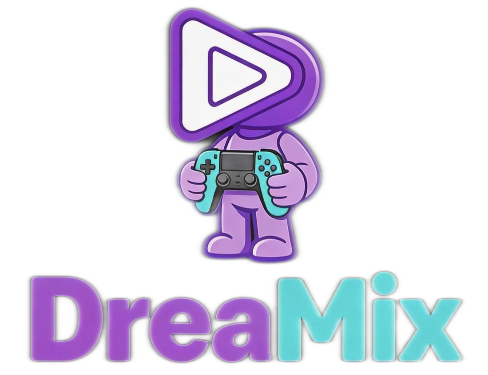

<div align="center">

 

# Action!

### AI原生互动视频Agent 🎬
### 从创意到互动故事 🎮

<p align="center">
  <a href="https://opensource.org/licenses/MIT">
    
  </a>
  <a href="https://www.python.org/">
    
  </a>
  <a href="https://github.com/Yuan-ManX/Dreamix">
    
  </a>
</p>

#### [English](./README.md) | [中文文档](./README_CN.md)

</div>

## 🌟 Action! 是什么？

Action!是一个AI原生的互动视频Agent平台，通过自然语言对话将创意转化为引人入胜的视频故事。通过将强大的AI Agent基础设施与先进的视频创作能力相结合，Dreamix实现了高质量视频制作的民主化，让从初学者到专业人士的每个人都能轻松使用。

Action!配备了智能的通用型AI工作者，可以处理研究、数据分析、媒体处理、文件管理和复杂工作流——展示了Dreamix先进能力所能实现的无限可能。

无论您是内容创作者、营销人员、教育工作者还是故事讲述者，Dreamix都能让您以前所未有的轻松和创意将愿景变为现实。

## ✨ 核心功能

### 🎬 专业时间线编辑器
- **多轨道编辑**：完整支持视频、音频、文本和效果轨道，具有独立控制
- **拖拽界面**：直观的剪辑管理，支持在轨道间拖拽和重新排序
- **精确时间线**：帧级精确编辑，带有缩放控制和时间标记
- **轨道管理**：锁定、静音和调整单个轨道的音量
- **剪辑操作**：剪切、修剪、分割和合并剪辑，具有专业精度
- **转场库**：10+内置转场效果，包括淡入淡出、溶解、滑动、擦除和缩放
- **剪辑选择**：可视化选择和单个剪辑的属性编辑
- **轨道操作**：添加、删除和管理多个视频、音频和文本轨道
- **历史系统**：所有编辑操作的完整撤销/重做功能

### 🎨 增强视频预览
- **实时预览**：即时视觉反馈您的编辑
- **帧导航**：逐帧浏览视频以进行精确编辑
- **波形可视化**：音频波形显示，实现完美的时间对齐
- **宽高比支持**：多种宽高比（16:9、9:16、1:1、4:3）适用于不同平台
- **播放控制**：变速播放（0.5x - 2x）、帧步进和循环模式
- **悬停预览**：悬停在时间线上时快速帧预览

### 🤖 智能Agent平台
- **多LLM支持**：通过LiteLLM与主要LLM提供商（Anthropic、OpenAI等）无缝协作
- **扩展工具系统**：全面的工具包，包括网络搜索、网页抓取、文件管理、命令执行、数据分析和媒体搜索
- **增强对话记忆**：高级上下文管理，支持实体跟踪、主题识别和偏好学习
- **安全与隔离**：内置安全上下文，包括工具使用限制、敏感操作跟踪和安全执行环境
- **专业化Agent**：为不同角色创建专业化Agent（视频创作、研究、分析）
- **多工具执行**：支持单次交互中的顺序工具调用

### 🌐 网络智能与研究
- **智能网络搜索**：内置DuckDuckGo集成，用于全面的网络研究
- **网页抓取**：支持CSS选择器，从任何网页提取和分析内容
- **研究综合**：结合多个来源进行全面分析和报告
- **竞争情报**：市场研究和趋势分析能力

### 📁 文件与系统操作
- **文件管理**：创建、读取、写入、删除和组织文件与目录
- **文档处理**：支持各种文档格式和文件操作
- **命令执行**：用于系统操作的安全命令行执行
- **数据分析**：用于数据处理的内置统计分析工具

### 🎬 智能视频创作
- **智能脚本生成**：根据您的主题自动生成故事情节、旁白和视觉建议
- **增强媒体搜索与组织**：通过智能标签自动查找、下载和组织相关图像和视频片段
- **高级风格迁移**：通过参考示例定义您喜欢的语气（休闲、专业、幽默等）
- **智能推荐**：推荐与内容情绪和风格相匹配的音乐、旁白和字体
- **ASR语音处理**：使用Whisper进行自动语音识别，用于转录生成和分析
- **语音粗切**：自动移除填充词、不流利表达和重复句子，带有时间戳对齐的分段

### 💬 对话式编辑
- **自然语言控制**：完全通过对话编辑您的视频 - 无需掌握复杂的时间线
- **扩展编辑命令**：支持修剪、分割、速度变化、字幕、效果、宽高比变化等
- **实时预览**：在您完善创作时即时查看更改
- **精确优化**：通过简单的提示调整颜色、字体、时间等
- **迭代改进**：通过多轮对话完善和打磨您的视频
- **技能应用**：直接通过对话应用预定义的工作流技能

### 🛠️ 增强的基于技能的工作流
- **扩展的内置技能**：7+预构建技能，包括快速介绍、电影风格、Vlog风格、语音粗切、产品评测、教育内容、社交媒体优化和纪录片风格
- **自定义技能创建**：将您完整的编辑工作流保存为可重用技能
- **批量处理**：将相同的风格和工作流立即应用于多个媒体资产
- **全面技能库**：访问用于常见视频创作模式的预构建技能，具有难度级别（初级、中级、高级）
- **分享与协作**：导出并与社区分享您的技能

### 🎵 高级音频处理
- **智能音乐推荐**：基于情绪、流派和内容分析
- **语音配置文件系统**：多种语音选项，支持语调和性别选择
- **字体推荐**：基于内容风格和情绪的智能字体建议
- **节拍同步**：自动音乐节拍与视频内容同步
- **音频时间**：精确的音频时间和同步工具

### 💾 高级项目管理
- **项目持久化**：保存和加载完整的视频项目，包含完整的时间线状态
- **撤销/重做历史**：完整的编辑历史，具有无限的撤销/重做功能
- **版本控制**：跟踪更改并恢复到以前的版本
- **项目元数据**：可自定义的项目设置，包括分辨率、帧率和宽高比
- **剪辑属性**：详细的剪辑元数据和属性编辑面板

## 🏗️ 架构

Dreamix构建在一个为可扩展性和可扩展性设计的内聚模块化架构之上：

### 核心组件
- **后端API**：为Agent编排、视频处理和增强媒体功能提供动力的Python/FastAPI服务
- **前端仪表板**：提供直观用户界面的Next.js/React应用程序
- **Agent运行时**：增强的隔离执行环境，用于安全的Agent操作，带有安全上下文
- **数据层**：PostgreSQL + Supabase，准备好用于持久存储和实时更新
- **语音处理系统**：基于Whisper的ASR，带有语音清理和粗切生成
- **增强媒体库**：带有智能索引的高级媒体资产管理

### 技术栈
- **后端**：Python 3.8+、FastAPI、LiteLLM
- **前端**：Next.js 14、React、TypeScript、Tailwind CSS
- **视频处理**：FFmpeg、MoviePy
- **语音识别**：OpenAI Whisper
- **网络工具**：Playwright、BeautifulSoup4、DuckDuckGo搜索
- **容器化**：Docker、Docker Compose
- **数据库**：PostgreSQL、Supabase（已就绪）

## 🚀 快速开始

### 前置要求
- Python 3.8或更高版本
- Node.js 18或更高版本
- FFmpeg（用于视频处理）
- 您首选LLM提供商的API密钥（OpenAI、Anthropic等）

### 安装

1. **克隆或下载仓库**
```bash
git clone https://github.com/Yuan-ManX/Action.git
cd Action
```

2. **设置后端**
```bash
cd backend
python -m venv venv
source venv/bin/activate  # 在Windows上：venv\Scripts\activate
pip install -r requirements.txt
```

3. **配置环境**
```bash
cp .env.example .env
# 编辑.env，填入您的API密钥和配置
```

4. **设置前端**
```bash
cd ../frontend
npm install
```

5. **安装Playwright（用于浏览器自动化）**
```bash
playwright install
```

6. **启动Dreamix**
```bash
cd ..
python start.py
```

这将自动启动：
- 后端API在http://localhost:8000
- API文档在http://localhost:8000/docs
- 前端仪表板在http://localhost:3000

7. **访问仪表板**
打开浏览器并导航到`http://localhost:3000`

## 📖 使用指南

### 创建您的第一个视频

1. **开始对话**：告诉Dreamix您想要创建什么样的视频
2. **提供输入**：上传您的媒体或让Dreamix为您找到相关内容
3. **查看脚本**：Dreamix将生成包含场景描述的完整脚本
4. **通过聊天完善**：使用自然语言进行调整
5. **渲染和导出**：当您满意时，渲染您的最终视频

### 使用智能Agent

Dreamix的AI Agent可以帮助完成各种任务：
- **网络研究**：让它研究主题、查找信息或分析网站
- **数据分析**：请求统计分析或数据处理
- **文件管理**：让它组织、创建或编辑文件
- **媒体搜索**：让它为您的项目查找图像和视频
- **系统操作**：用于开发任务的安全命令执行

### 语音处理与粗切

1. **上传音频/视频**：提供您的语音素材
2. **生成转录**：自动ASR转录，带有词级时间戳
3. **清理语音**：自动移除填充词、不流利表达和重复
4. **创建粗切**：获得清理后的、时间戳对齐的版本，准备好进行编辑

### 示例提示

```
"创建一个60秒的无线耳机产品评测视频，重点关注音质和电池续航。"
```

```
"让这个视频更欢快，将背景音乐换成充满活力的内容，并在结尾添加号召性用语。"
```

```
"将此工作流保存为'产品评测'技能，以便我可以将其应用于其他产品。"
```

```
"研究AI视频创作的最新趋势，并编制一份综合报告。"
```

```
"转录这个采访视频，并通过移除填充词创建粗切。"
```

```
"将'社交媒体优化'技能应用于这个TikTok视频。"
```

### 探索仪表板

- **编辑器**：具有多轨道支持的专业时间线编辑器，用于精确视频编辑
- **聊天**：通过对话创建和编辑视频的主界面
- **技能**：浏览和使用预构建的视频创作技能，或创建自己的技能
- **历史记录**：查看和管理您以前创建的视频
- **媒体库**：增强的媒体资产管理，带有搜索和标签
- **设置**：配置您的个人资料、API密钥和偏好

### 使用专业时间线编辑器

1. **打开编辑器**：从侧边栏导航到编辑器页面
2. **添加剪辑**：点击"添加剪辑"导入媒体或使用拖拽界面
3. **排列剪辑**：沿时间线或在轨道之间拖拽剪辑
4. **编辑剪辑**：选择剪辑以在侧边栏中查看和编辑其属性
5. **添加转场**：使用转场库在剪辑之间添加平滑效果
6. **分割和修剪**：使用分割工具在特定时间分割剪辑
7. **撤销/重做**：使用键盘快捷键（Ctrl+Z/Ctrl+Shift+Z）撤销或重做更改
8. **保存和导出**：保存您的项目并在准备好时导出

## 🧪 测试

Dreamix包括用于后端和前端组件的全面测试套件：

### 后端测试
```bash
cd backend
source venv/bin/activate
python -m pytest tests/ -v
```

### 运行单个测试脚本
```bash
# 测试对话式编辑系统
python test_conversational_editing.py

# 测试技能系统
python test_skill_system.py

# 测试Agent系统
python test_agent_system.py

# 测试语音处理
python test_speech_processing.py
```

## 🎯 用例

- **内容创作者**：大规模制作引人入胜的社交媒体内容
- **营销人员**：创建引人注目的产品演示和促销视频
- **教育工作者**：将课程转化为互动教育内容
- **故事讲述者**：通过AI驱动的旁白和视觉效果让您的故事栩栩如生
- **企业**：自动化用于培训、入职和沟通的视频制作
- **研究人员**：进行全面的网络研究和分析
- **播客和Vlogger**：自动生成转录并清理语音素材
- **视频编辑器**：通过AI辅助的粗切和基于技能的编辑加速工作流

## 🤝 贡献

我们欢迎社区的贡献！无论您是修复错误、添加功能还是改进文档，我们都感谢您的帮助。

有关更多详细信息，请参阅我们的[贡献指南](CONTRIBUTING.md)。

## 📄 许可证

Dreamix根据 MIT 许可。有关详细信息，请参阅[LICENSE](LICENSE)文件。

## ⭐ 星标历史

如果您喜欢这个项目，请 ⭐ 给仓库加星。您的支持帮助我们成长！

<p align="center">
  <a href="https://star-history.com/#Yuan-ManX/Action&Date">
    
  </a>
</p>


<div align="center">

**Dreamix团队用心打造 ❤️**

</div>
